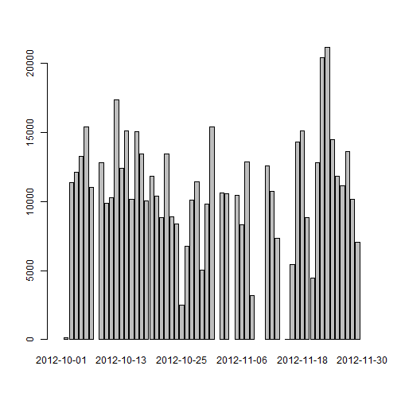
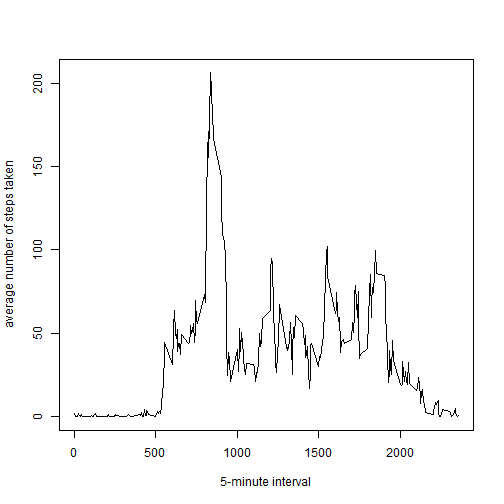
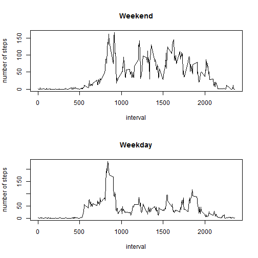

# Reproducible Research: Peer Assessment 1


## Loading and preprocessing the data

```r
activitydata<-read.csv("activity.csv")
```

## What is mean total number of steps taken per day?

```r
barplot(sapply(split(activitydata$steps, activitydata$date), sum))
```

 

```r
mean(sapply(split(activitydata$steps, activitydata$date), sum), na.rm=TRUE)
```

```
## [1] 10766
```

```r
median(sapply(split(activitydata$steps, activitydata$date), sum), na.rm=TRUE)
```

```
## [1] 10765
```

## What is the average daily activity pattern?

```r
library(doBy)
stepsinterval<-summaryBy(steps~interval, data=activitydata, FUN=function(x) mean(x,na.rm=TRUE))
plot(stepsinterval, type='l', xlab='5-minute interval', ylab='average number of steps taken')
```

 

```r
maxstep<-stepsinterval[stepsinterval[2]==max(stepsinterval[2])]
maxstep
```

```
## [1] 835.0 206.2
```

The 5-minute interval is 835

## Imputing missing values
Calculate and report the total number of missing values in the dataset

```r
misstable<-table(sapply(is.na(activitydata), any))
misstable
```

```
## 
## FALSE  TRUE 
## 50400  2304
```
The total number of missing values is 2304

Fill in all of the missing values in the dataset by the mean for that 5-minute interval. Create a new dataset that is equal to the original dataset but with the missing data filled in.

```r
newactivitydata=activitydata
for (interval in stepsinterval$interval) {newactivitydata[newactivitydata$interval==interval & is.na(newactivitydata$steps),]$steps=c(round(stepsinterval[stepsinterval$interval==interval,][2]))}
newactivitydata$steps=as.integer(newactivitydata$steps)
```

## Are there differences in activity patterns between weekdays and weekends?

```r
barplot(sapply(split(newactivitydata$steps, newactivitydata$date), sum))
```

 

```r
mean(sapply(split(newactivitydata$steps, newactivitydata$date), sum), na.rm=TRUE)
```

```
## [1] 10766
```

```r
median(sapply(split(newactivitydata$steps, newactivitydata$date), sum), na.rm=TRUE)
```

```
## [1] 10762
```
These values differ from the estimates from the first part of the assignment. The impact of imputing missing data on the estimates of the total daily number of steps is very small.

Create a new factor variable in the dataset with two levels - "weekday" and "weekend"

```r
newactivitydata$date=strptime(newactivitydata$date, format='%Y-%m-%d')
newactivitydata$weekday="weekday"
newactivitydata[weekdays(newactivitydata$date) %in% c("Sunday", "Saturday"),]$weekday="weekend"
newactivitydata$weekday=as.factor(newactivitydata$weekday)
```

Make a panel plot containing a time series plot of the 5-minute interval (x-axis) and the average number of steps taken, averaged across all weekday days or weekend days (y-axis). 

```r
par(mfrow=c(2,1))
plot(summaryBy(steps~interval, data=newactivitydata[newactivitydata$weekday=="weekend",], FUN=mean), type='l', xlab='interval', ylab='number of steps', main="Weekend")
plot(summaryBy(steps~interval, data=newactivitydata[newactivitydata$weekday=="weekday",], FUN=mean), type='l', xlab='interval', ylab='number of steps', main="Weekday")
```

 
